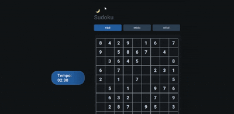

# 🧩 Sudoku Game

> Desafie sua mente com este Sudoku interativo! Complete o tabuleiro preenchendo os números de 1 a 9 sem repetir em linhas, colunas ou blocos.

<p align="center">
  
  
  
</p>

---

## 🎮 Demonstração

<p align="center">
    
</p>

---

## ✨ Funcionalidades

- Interface moderna e responsiva (modo escuro/claro)

- Três níveis de dificuldade: Fácil, Médio, Difícil

- Timer com alerta de tempo esgotado

- Modo notas para marcações nas células

- Botões de desfazer, apagar e dicas (máx. 5 dicas)

- Validação automática das regras do Sudoku

- Pop-ups animados para vitória e fim de tempo

---

## 🕹️ Como jogar

- **Não repita números:**  
  Cada linha, coluna e quadrado 3x3 deve conter todos os números de 1 a 9, sem repetições.
- **Comece com as pistas:**  
  O Sudoku inicia com alguns números já preenchidos, que servem como pistas para resolver o quebra-cabeça.
- **Use lógica:**  
  A resolução depende de observar linhas, colunas e quadrados para identificar onde cada número pode ser colocado.

### Passo a passo

1. **Analise a grade:**  
   Observe as linhas, colunas e quadrados 3x3 para identificar os números presentes e os que faltam.
2. **Procure possibilidades:**  
   Identifique células onde apenas um número pode ser colocado, com base nas restrições.
3. **Preencha as células:**  
   Coloque os números nas células corretas, garantindo que nenhuma regra seja violada.
4. **Use marcações (opcional):**  
   Anote possibilidades em células que ainda não têm um número final, facilitando a solução.
5. **Repita o processo:**  
   Continue analisando e preenchendo as células até completar o tabuleiro.

---

## 🚀 Tecnologias

<div align="center">

| Frontend | Lógica      |
|----------|-------------|
| HTML5    | JavaScript  |
| CSS3     | script.js  |

</div>

---

## 📦 Como usar

1. **Clone este repositório:**

   ```bash
   git clone https://github.com/iwillalwaysloveu/Sudoku.git

2. **Abra o arquivo `index.html` no seu navegador.**

3. **Ou jogue em <https://sudoplay.up.railway.app/> !!**

---

## 🗂️ Estrutura dos arquivos

- `index.html`: Estrutura do jogo
- `styles.css`: Estilos visuais
- `script.js` : Lógica do jogo e interações

---

## 📝 Observações

- O backend do jogo está em `script.js`.

---

## 👨‍💻 Autor

- Feito por [iwillalwaysloveu](https://github.com/iwillalwaysloveu)
- Aprimorado por [Charaktane](https://github.com/Charaktane)

---

## 📄 Licença

Este projeto está sob a licença MIT.

---

<p align="center">
  <sub>⭐️ Deixe uma estrela se gostou do projeto!</sub>
</p>
